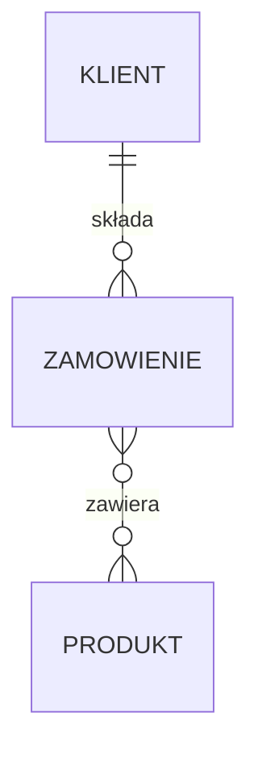

Projektowanie bazy danych to sztuka zamieniania rzeczywistych problemów na logiczne, czytelne i wydajne struktury danych. Dobrze zaprojektowana baza ułatwia przechowywanie, wyszukiwanie i analizę informacji, a także minimalizuje błędy i powielanie danych.

## Spis treści

1. [Czym jest projektowanie bazy danych?](#czym-jest-projektowanie-bazy-danych)
2. [Modelowanie danych i diagramy ERD](#modelowanie-danych-i-diagramy-erd)
   - [Przykład praktyczny: minidiagram ERD dla sklepu](#przykład-praktyczny-minidiagram-erd-dla-sklepu)
3. [Podstawowe pojęcia: encja, atrybut, relacja](#podstawowe-pojęcia-encja-atrybut-relacja)
   - [Przykład encji z atrybutami](#przykład-encji-z-atrybutami)
4. [Rodzaje relacji między tabelami](#rodzaje-relacji-między-tabelami)
   - [Jeden do jednego (1:1)](#jeden-do-jednego-11)
   - [Jeden do wielu (1:N)](#jeden-do-wielu-1n)
   - [Wiele do wielu (N:M)](#wiele-do-wielu-nm)
   - [Przykłady relacji i ich implementacja](#przykłady-relacji-i-ich-implementacja)
5. [Klucze główne i obce](#klucze-główne-i-obce)
   - [Przykład praktyczny: klucz główny i obcy](#przykład-praktyczny-klucz-główny-i-obcy)
6. [Normalizacja danych](#normalizacja-danych)
   - [Pierwsza postać normalna (1NF)](#pierwsza-postać-normalna-1nf)
   - [Druga postać normalna (2NF)](#druga-postać-normalna-2nf)
   - [Trzecia postać normalna (3NF)](#trzecia-postać-normalna-3nf)
   - [Przykład normalizacji krok po kroku](#przykład-normalizacji-krok-po-kroku)
7. [Typowe błędy projektowe](#typowe-błędy-projektowe)
   - [Przykłady błędów i ich skutki](#przykłady-błędów-i-ich-skutki)
8. [Dobre praktyki projektowe](#dobre-praktyki-projektowe)
   - [Praktyczne wskazówki](#praktyczne-wskazówki)
9. [Praktyczne zadania](#praktyczne-zadania)
10. [Podsumowanie](#podsumowanie)

---

## Czym jest projektowanie bazy danych?

Projektowanie bazy danych polega na przemyślanym zaplanowaniu, jakie informacje będą przechowywane, jak będą powiązane oraz jak zapewnić spójność i efektywność przechowywania danych. To proces analizy rzeczywistego problemu, wydzielenia kluczowych obiektów (encje), ich cech (atrybuty) i wzajemnych powiązań (relacje).

---

## Modelowanie danych i diagramy ERD

**Modelowanie danych** to proces odwzorowania rzeczywistości na strukturę bazy. W praktyce używamy do tego _diagramów ERD_ (Entity-Relationship Diagram), które graficznie przedstawiają encje oraz relacje między nimi.

- **Encja** – np. Użytkownik, Zamówienie, Produkt.
- **Atrybut** – cecha encji np. imię, data zamówienia, cena produktu.
- **Relacja** – powiązanie między encjami, np. "Użytkownik składa Zamówienie".

### Przykład praktyczny: minidiagram ERD dla sklepu

Wyobraź sobie sklep internetowy.

```
[Klient] 1---N [Zamówienie] N---M [Produkt]
```

- Klient składa wiele zamówień.
- Zamówienie może dotyczyć wielu produktów (i odwrotnie: produkt może być w wielu zamówieniach).

---

## Podstawowe pojęcia: encja, atrybut, relacja

- **Encja** (entity): reprezentuje obiekt rzeczywisty lub pojęciowy, np. Klient, Produkt, Faktura.
- **Atrybut**: pojedyncza informacja opisująca encję, np. imię, cena, numer faktury.
- **Relacja**: związek między encjami, np. klient składa zamówienie.

### Przykład encji z atrybutami

**Encja:** Klient  
**Atrybuty:** id_klienta, imie, email, adres

**Encja:** Produkt  
**Atrybuty:** id_produktu, nazwa, cena

---

## Rodzaje relacji między tabelami

### Jeden do jednego (1:1)

Każdemu rekordowi z jednej tabeli odpowiada dokładnie jeden rekord z drugiej tabeli.

**Przykład:** Każdy użytkownik ma jeden profil.

**Implementacja:** najczęściej przez dzielenie rzadko używanych danych na osobną tabelę np.  
Tabela `Uzytkownik` i tabela `Profil` powiązana polem `id`.

### Jeden do wielu (1:N)

Jeden rekord z pierwszej tabeli może być powiązany z wieloma rekordami z drugiej tabeli.

**Przykład:** Jeden klient może złożyć wiele zamówień.

**Implementacja:**  
Tabela `Klient` (id)  
Tabela `Zamowienie` (id, klient_id)

### Wiele do wielu (N:M)

Wiele rekordów z jednej tabeli może być powiązanych z wieloma rekordami z drugiej tabeli.  
**Przykład:** Studenci zapisani na wiele kursów, kursy mają wielu studentów.

**Implementacja:**  
Tabela pośrednicząca, np. `Student_Kurs` (student_id, kurs_id)

#### Przykłady relacji i ich implementacja



---

## Klucze główne i obce

- **Klucz główny (Primary Key):** unikalny identyfikator rekordu w tabeli, np. id.
- **Klucz obcy (Foreign Key):** pole wskazujące na klucz główny rekordu w innej tabeli, używany do tworzenia relacji.

### Przykład praktyczny: klucz główny i obcy

Tabela `Klient`  
| id | imie | email |
|----|-------|----------------|
| 1 | Jan | `jan@ex.com` |

Tabela `Zamowienie`  
| id | data | klient_id |
|----|------------|-----------|
| 1 | 2025-07-05 | 1 |

Tutaj `klient_id` w `Zamowienie` to klucz obcy wskazujący na `id` w `Klient`.

---

## Normalizacja danych

Normalizacja to proces podziału danych na tabele w taki sposób, aby:

- unikać powielania informacji (redukcja nadmiarowości),
- zapewnić spójność i łatwość utrzymania danych.

### Pierwsza postać normalna (1NF)

- Każda kolumna przechowuje tylko jedną wartość (brak list/pól wielowartościowych).
- Każdy rekord jest unikalny.

**Błąd:**  
| id | imie | telefony |
|----|------|------------------|
| 1 | Jan | 123456, 987654 |

**Poprawnie:**  
| id | imie | telefon |
|----|------|----------|
| 1 | Jan | 123456 |
| 1 | Jan | 987654 |

### Druga postać normalna (2NF)

- Spełnia 1NF.
- Każdy atrybut niebędący częścią klucza zależy w pełni od klucza głównego.

**Przykład błędu:**  
Tabela `Zamowienie_Produkt` (zamowienie_id, produkt_id, nazwa_produktu, cena)  
Nazwa produktu zależy od produktu, nie od zamówienia!

**Poprawnie:**  
Tabela `Produkt` (id, nazwa_produktu, cena)  
Tabela `Zamowienie_Produkt` (zamowienie_id, produkt_id)

### Trzecia postać normalna (3NF)

- Spełnia 2NF.
- Każdy atrybut niebędący kluczem nie zależy od innych atrybutów niebędących kluczem.

**Przykład błędu:**  
Tabela `Klient` (id, imie, kod_pocztowy, miasto) – miasto zależy od kodu pocztowego, nie od klienta.

**Poprawnie:**  
Tabela `Kod_Pocztowy` (kod, miasto)  
Tabela `Klient` (id, imie, kod_pocztowy)

### Przykład normalizacji krok po kroku

Masz tabelę:

| id  | imie | adres          | miasto   | nazwa_produktu | cena |
| --- | ---- | -------------- | -------- | -------------- | ---- |
| 1   | Jan  | ul. Kwiatowa 1 | Kraków   | Laptop         | 3000 |
| 2   | Anna | ul. Polna 2    | Warszawa | Telefon        | 1000 |

**Krok 1:** Podziel na Klient i Produkt  
Tabela Klient: (id, imie, adres, miasto)  
Tabela Produkt: (id, nazwa_produktu, cena)  
Tabela Zakup: (id_klienta, id_produktu)

---

## Typowe błędy projektowe

- Nadmiarowość danych (te same informacje w wielu miejscach)
- Brak kluczy głównych lub obcych
- Zbyt duże tabele (brak podziału na logiczne encje)
- Błędne relacje (np. wiele do wielu bez tabeli pośredniczącej)
- Brak normalizacji

### Przykłady błędów i ich skutki

- Powielanie danych: trudność w aktualizacji, różne wersje tej samej informacji.
- Brak kluczy: możliwość wprowadzenia duplikatów lub "sierot" w relacjach.
- Brak relacji wiele-do-wielu: niemożność odwzorowania rzeczywistego powiązania.

---

## Dobre praktyki projektowe

- Zawsze stosuj klucze główne i obce.
- Stosuj normalizację do 3NF (chyba, że uzasadnione jest inaczej).
- Czytelnie nazywaj tabele i kolumny (np. klient_id, produkt_id).
- Twórz diagramy ERD przed implementacją.
- Dokumentuj strukturę bazy danych.
- Przemyśl przyszły rozwój bazy (możliwość rozszerzenia).

### Praktyczne wskazówki

- Wyobraź sobie przykładowe dane i sprawdź, czy struktura pozwala na ich przechowywanie bez powielania.
- Zastanów się, czy łatwo będzie wyciągnąć potrzebne informacje (np. wszystkich klientów, którzy kupili dany produkt).
- Konsultuj projekt z innymi – świeże spojrzenie może ujawnić ukryte problemy.

---

## Praktyczne zadania

### Zadanie 1: Identyfikacja encji i relacji

W sklepie internetowym mamy: Klienta, Zamówienie, Produkt. Zidentyfikuj encje, ich atrybuty i relacje.

<details>
  <summary>Pokaż rozwiązanie</summary>

Encje:

- Klient (id, imie, email)
- Zamówienie (id, data, klient_id)
- Produkt (id, nazwa, cena)

Relacje:

- Klient składa Zamówienie (1:N)
- Zamówienie obejmuje Produkty (N:M, przez tabelę pośredniczącą)
</details>

---

### Zadanie 2: Diagram ERD

Narysuj (lub opisz tekstowo) diagram ERD dla powyższego sklepu.

<details>
  <summary>Pokaż rozwiązanie</summary>

```
[Klient] 1---N [Zamówienie] N---M [Produkt]
```

Tabele:

- Klient (id, imie, email)
- Zamówienie (id, data, klient_id)
- Produkt (id, nazwa, cena)
- Zamowienie_Produkt (zamowienie_id, produkt_id, ilosc)
</details>

---

### Zadanie 3: Normalizacja

Masz tabelę:

| id  | imie | adres          | miasto   | nazwa_produktu | cena |
| --- | ---- | -------------- | -------- | -------------- | ---- |
| 1   | Jan  | ul. Kwiatowa 1 | Kraków   | Laptop         | 3000 |
| 2   | Anna | ul. Polna 2    | Warszawa | Telefon        | 1000 |

Podziel ją na znormalizowane tabele.

<details>
  <summary>Pokaż rozwiązanie</summary>

Tabela Klient: (id, imie, adres, miasto)  
Tabela Produkt: (id, nazwa_produktu, cena)  
Tabela Zakup: (id_klienta, id_produktu)

</details>

---

### Zadanie 4: Rodzaje relacji

Opisz, czym różni się relacja jeden-do-wielu od wiele-do-wielu i podaj przykład.

<details>
  <summary>Pokaż rozwiązanie</summary>

Jeden-do-wielu: jeden klient może mieć wiele zamówień, ale każde zamówienie należy do jednego klienta.  
Wiele-do-wielu: jeden student może być zapisany na wiele kursów i jeden kurs może mieć wielu studentów.

</details>

---

### Zadanie 5: Przykład złego i dobrego projektu

Podaj przykład tabeli z powielaniem danych oraz jej poprawnej wersji po normalizacji.

<details>
  <summary>Pokaż rozwiązanie</summary>

**Zły projekt:**

| id  | imie | produkt1 | produkt2 | produkt3 |
| --- | ---- | -------- | -------- | -------- |
| 1   | Jan  | Laptop   | Telefon  | Tablet   |

**Dobry projekt:**

Tabela Klient: (id, imie)  
Tabela Produkt: (id, nazwa)  
Tabela Klient_Produkt: (id_klienta, id_produktu)

**Wyjaśnienie:**  
Zamiast wielu kolumn dla produktów, każda relacja klient-produkt to osobny rekord w tabeli pośredniczącej.

</details>

---

## Podsumowanie

Projektowanie bazy danych to kluczowy etap w każdym projekcie IT opartym o dane. Przemyślana struktura, normalizacja i dobre praktyki zapewnią łatwość rozwoju, wydajność i bezpieczeństwo systemu. Analiza, przykłady i praktyczne zadania pomagają zrozumieć, jakie decyzje podjąć, by Twoja baza była solidna i przyszłościowa!
